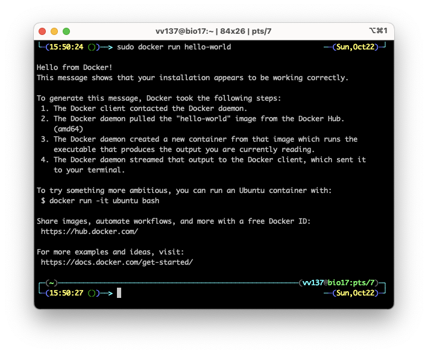
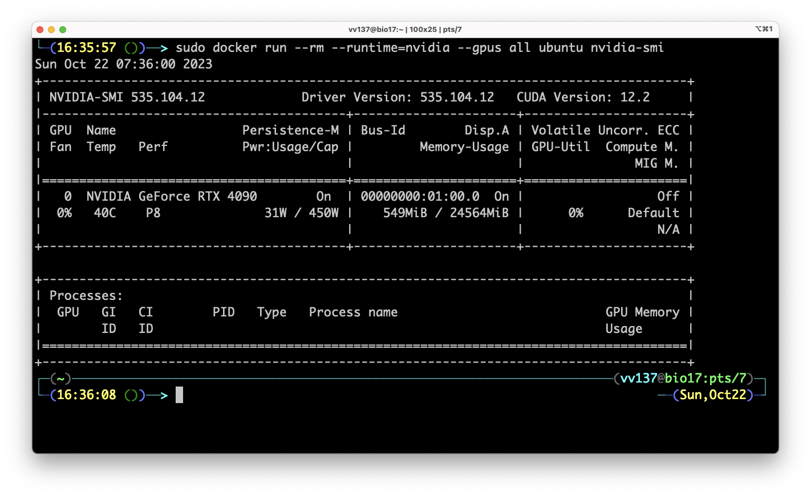
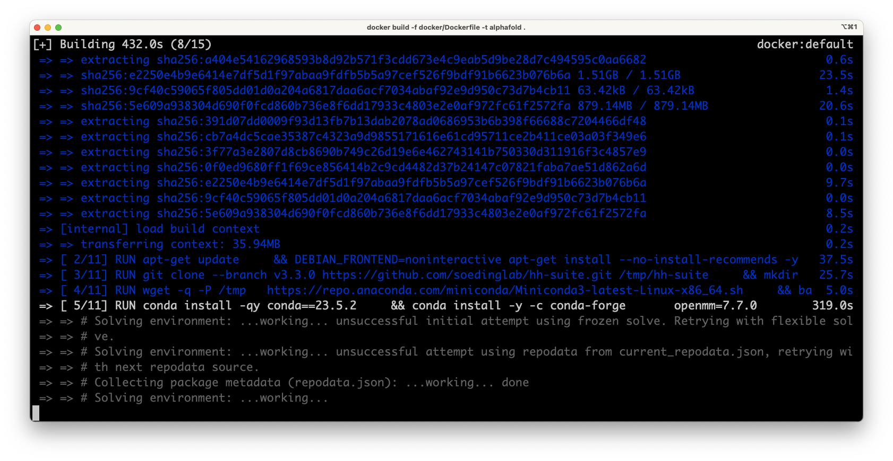

# AlphaFold 쌩초보 가이드(?)

## 준비물

### 기계 준비하기

1. Linux가 설치된 AMD64 CPU가 설치된 computer.
    - Intel Core seriers, Xeon series, ...
    - AMD Ryzen, EPYC, ...
1. NVIDIA GPU가 필요함.
    - High-end gaming GPUs: RTX 3090, RTX 4090
    - Data center GPUs: V100, A100, ...
1. Git과 Python 3이 설치되어 있어야 함.

## Docker Engine

### Docker는 무엇인가

- Docker는 환경을 분리하여 리소스를 관리하고 의존성 문제를 해결하는 solution임.
- Software engineering에서 절찬리 사용중 (2023년 기준)
- [이곳](https://docs.docker.com/engine/install/)에 Linux 배포판 별로 설치 방법이 상세하게 작성되어 있음.
- Google이 매우 잘 활용하고 있으므로 AlphaFold도 Docker 기반으로 배포되고 있음.

### 설치하기

- OS는 Linux만 가능함.
- 배포판은 Ubuntu, REHL 같은 유명한 것은 가능함.
- Superuser 권한이 필요함.
- Ubuntu 22.04 LTS기준으로 설명함.

Apt는 Ubuntu와 같은 Debian 계통 배포판에서 사용되는 (Apple의 앱스토어 같은) 패키지 관리자임.
다음은 APT에 Docker의 저장소를 등록하는 과정임.

```bash
# Add Docker's official GPG key:
sudo apt-get update
sudo apt-get install -y ca-certificates curl gnupg
sudo install -m 0755 -d /etc/apt/keyrings
curl -fsSL https://download.docker.com/linux/ubuntu/gpg | sudo gpg --dearmor -o /etc/apt/keyrings/docker.gpg
sudo chmod a+r /etc/apt/keyrings/docker.gpg

# Add the repository to Apt sources:
echo \
  "deb [arch="$(dpkg --print-architecture)" signed-by=/etc/apt/keyrings/docker.gpg] https://download.docker.com/linux/ubuntu \
  "$(. /etc/os-release && echo "$VERSION_CODENAME")" stable" | \
  sudo tee /etc/apt/sources.list.d/docker.list > /dev/null
sudo apt-get update
```

Docker Engine을 받아와서 설치함.

```bash
sudo apt-get install -y docker-ce docker-ce-cli containerd.io docker-buildx-plugin docker-compose-plugin
```

다음을 실행했을 때 아래와 같이 출력되면 성공!

```bash
sudo docker run hello-world
```



### Root 권한 없이 Docker 사용하기

- Docker는 기본적으로 실행에 root 권한이 필요함.
- 특정 사용자에게 Docker의 사용 권한을 부여할 수 있음.

`$USER`를 권한을 부여할 사용자의 이름으로 변경하여 다음을 실행하면 사용자가 등록됨.

```bash
sudo groupadd docker
sudo usermod -aG docker $USER
```

## NVIDIA Contatiner Toolkit

- Docker container 내부에서 GPU를 사용하기 위해서 필요한 toolkit임.
- System에 반드시 CUDA driver가 설치되어 있어야 작동함.

### CUDA driver

[이곳](https://developer.nvidia.com/cuda-downloads)을 참조하여 driver를 설치하면 됨. (생략)

### 설치하기

[이곳](https://docs.nvidia.com/datacenter/cloud-native/container-toolkit/latest/install-guide.html) 다른 배포판에 관하여 설명되어 있음.

Apt에 저장소 등록하기.

```bash
curl -fsSL https://nvidia.github.io/libnvidia-container/gpgkey | sudo gpg --dearmor -o /usr/share/keyrings/nvidia-container-toolkit-keyring.gpg \
  && curl -s -L https://nvidia.github.io/libnvidia-container/stable/deb/nvidia-container-toolkit.list | \
    sed 's#deb https://#deb [signed-by=/usr/share/keyrings/nvidia-container-toolkit-keyring.gpg] https://#g' | \
    sudo tee /etc/apt/sources.list.d/nvidia-container-toolkit.list \
  && \
    sudo apt-get update
```

Apt로 패키지 설치하기.

```bash
sudo apt-get install -y nvidia-container-toolkit
```

다음을 실행해서 Docker에서 CUDA를 사용할 수 있도록 설정함.

```bash
sudo nvidia-ctk runtime configure --runtime=docker
sudo systemctl restart docker

sudo nvidia-ctk runtime configure --runtime=containerd
sudo systemctl restart containerd

sudo nvidia-ctk runtime configure --runtime=crio
sudo systemctl restart crio
```

다음을 실행했을 때 장착된 장비의 정보가 출력되면 성공한 것임.

```bash
sudo docker run --rm --runtime=nvidia --gpus all ubuntu nvidia-smi
```



## AlphaFold 설치하기

### AlphaFold Git 저장소 받아오기

```bash
git clone https://github.com/deepmind/alphafold.git
cd ./alphafold
```

### Database와 parameter 받아오기

- Database를 받아오려면 `aria2c`가 필요함. (`sudo alt install aria2`로 설치함.)
- 모든 database를 download하면 대략 2.62 TB의 공간이 필요함.
- `$DOWNLOAD_DIR`를 file을 저장할 directory로 변경하고 다음을 실행함.
- 인내심과 큰 공간이 필요함. (하루는 잡고 기다려야함.)
- Download 중에 연결이 끊어진 경우 `scripts/` directory에 있는 개별 항목을 받아오는 script를 실행하면 이어받기가 됨.

```bash
scripts/download_all_data.sh $DOWNLOAD_DIR
```

- 모두 받으면 다음과 같음.

```plain text
$DOWNLOAD_DIR/                             # Total: ~ 2.62 TB (download: 556 GB)
    bfd/                                   # ~ 1.8 TB (download: 271.6 GB)
        # 6 files.
    mgnify/                                # ~ 120 GB (download: 67 GB)
        mgy_clusters_2022_05.fa
    params/                                # ~ 5.3 GB (download: 5.3 GB)
        # 5 CASP14 models,
        # 5 pTM models,
        # 5 AlphaFold-Multimer models,
        # LICENSE,
        # = 16 files.
    pdb70/                                 # ~ 56 GB (download: 19.5 GB)
        # 9 files.
    pdb_mmcif/                             # ~ 238 GB (download: 43 GB)
        mmcif_files/
            # About 199,000 .cif files.
        obsolete.dat
    pdb_seqres/                            # ~ 0.2 GB (download: 0.2 GB)
        pdb_seqres.txt
    small_bfd/                             # ~ 17 GB (download: 9.6 GB)
        bfd-first_non_consensus_sequences.fasta
    uniref30/                              # ~ 206 GB (download: 52.5 GB)
        # 7 files.
    uniprot/                               # ~ 105 GB (download: 53 GB)
        uniprot.fasta
    uniref90/                              # ~ 67 GB (download: 34 GB)
        uniref90.fasta
```

### Docker image 생성하기

- 다음 명령으로 AlphaFold docker image를 생성함.
- 꽤 오래 걸리는 작업임 (10-20분 정도 소요).

```bash
docker build -f docker/Dockerfile -t alphafold .
```

- (2023-10-22) Ada Lovelace (RTX 4000 series)를 사용하려면 `docker/Dockerfile`을 수정해야함.

```diff title="docker/Dockerfile"
--- a/docker/Dockerfile
+++ b/docker/Dockerfile
@@ -12,7 +12,7 @@
 # See the License for the specific language governing permissions and
 # limitations under the License.

-ARG CUDA=11.1.1
-FROM nvidia/cuda:${CUDA}-cudnn8-runtime-ubuntu18.04
+ARG CUDA=11.8.0
+FROM nvidia/cuda:${CUDA}-cudnn8-devel-ubuntu18.04
 # FROM directive resets ARGS, so we specify again (the value is retained if
 # previously set).
@@ -53,13 +53,13 @@ RUN wget -q -P /tmp \

 # Install conda packages.
 ENV PATH="/opt/conda/bin:$PATH"
-RUN conda install -qy conda==4.13.0 \
-    && conda install -y -c conda-forge \
-      openmm=7.5.1 \
-      cudatoolkit==${CUDA_VERSION} \
+# RUN conda install -qy conda==23.7.2 \
+RUN conda install -y -c conda-forge \
+      openmm=7.7.0 \
+      cudatoolkit=${CUDA_VERSION} \
       pdbfixer \
       pip \
-      python=3.8 \
+      python=3.9 \
       && conda clean --all --force-pkgs-dirs --yes

 COPY . /app/alphafold
@@ -70,13 +70,13 @@ RUN wget -q -P /app/alphafold/alphafold/common/ \
 RUN pip3 install --upgrade pip --no-cache-dir \
     && pip3 install -r /app/alphafold/requirements.txt --no-cache-dir \
     && pip3 install --upgrade --no-cache-dir \
-      jax==0.3.25 \
-      jaxlib==0.3.25+cuda11.cudnn805 \
+      jax==0.4.13 \
+      jaxlib==0.4.13+cuda11.cudnn86 \
       -f https://storage.googleapis.com/jax-releases/jax_cuda_releases.html

 # Apply OpenMM patch.
-WORKDIR /opt/conda/lib/python3.8/site-packages
-RUN patch -p0 < /app/alphafold/docker/openmm.patch
+# WORKDIR /opt/conda/lib/python3.9/site-packages
+# RUN patch -p1 < /app/alphafold/docker/openmm.patch

 # Add SETUID bit to the ldconfig binary so that non-root users can run it.
 RUN chmod u+s /sbin/ldconfig.real
```

- 다음과 같은 출력이 나오면 인내심을 갖고 기다려봅시다.



### Python dependency 설치하기

- 이왕이면 Python virtual environemnt이나 Conda와 같은 방법으로 의존성 관리를 하는 것이 권장됨.
- 다음 명령을 실행하여 필요한 Python 패키지를 설치한다.

```bash
pip3 install -r docker/requirements.txt
```

- (2023-10-22) 다음을 실행하여 기본으로 설치되는 패키지의 버전을 변경해야함.

```bash
pip3 uninstall "requests"
pip3 install "requests==2.28.1"
```

### 입력 준비하기

- 단백질의 서열은 FASTA format으로 입력받음.

```plain
>Protein-G
YKLILNGKTLKGETTTEAVDAATAEKVFKQYANDNGVDGEWTYDDATKTFTVTE
```

### 실행하기

- Clone된 AlahaFold repository가 저장된 directory에서 다음을 실행함.
- `$FASTA_PATH`에는 예측한 서열을 담은 FASTA 형식의 입력 file의 경로를 넣음.
- `$OUTPUT_DIR`에는 예측 결과를 저장할 directroy의 경로를 넣음.
- `$DOWNLOAD_DIR`에는 위에서 download한 database의 경로를 넣음.

```bash
python3 "docker/run_docker.py" \
  --fasta_paths="$FASTA_PATH" \
  --max_template_date="2022-01-01" \
  --model_preset="monomer" \
  --db_preset=full_dbs \
  --data_dir="$DOWNLOAD_DIR" \
  --output_dir="OUTPUT_DIR"
```

- Multimer의 경우 다음과 같이 여러 서열이 들어간 FASTA를 작성하고 preset을 변경하면됨.

```bash
python3 "docker/run_docker.py" \
  --fasta_paths="$FASTA_PATH" \
  --max_template_date="2022-01-01" \
  --model_preset="monomer" \
  --db_preset=full_dbs \
  --data_dir="$DOWNLOAD_DIR" \
  --output_dir="OUTPUT_DIR"
```

### 결과 분석

- 예측된 model은 PDB 또는 mmCIF 형식으로 출력됨.
- PyMOL, VMD, Chiemera 등으로 시각화 가능함.
- AlphaFold는 자체적인 정확도 예측 점수를 출력함.

```plain
% Database query result
msas/
% Self-confidence predictions
confidence_model_1_pred_0.json
confidence_model_2_pred_0.json
confidence_model_3_pred_0.json
confidence_model_4_pred_0.json
confidence_model_5_pred_0.json
% Input features
features.pkl
% Output structure sorted by predicted condidence scores
ranked_0.cif
ranked_0.pdb
ranked_1.cif
ranked_1.pdb
ranked_2.cif
ranked_2.pdb
ranked_3.cif
ranked_3.pdb
ranked_4.cif
ranked_4.pdb
% Ranking details
ranking_debug.json
% Physically relaxed models
relaxed_model_2_pred_0.cif
relaxed_model_2_pred_0.pdb
relaxed_model_5_pred_0.cif
relaxed_model_5_pred_0.pdb
relax_metrics.json
% Detailed outputs
result_model_1_pred_0.pkl
result_model_2_pred_0.pkl
result_model_3_pred_0.pkl
result_model_4_pred_0.pkl
result_model_5_pred_0.pkl
% Unrelaxed models
unrelaxed_model_1_pred_0.cif
unrelaxed_model_1_pred_0.pdb
unrelaxed_model_2_pred_0.cif
unrelaxed_model_2_pred_0.pdb
unrelaxed_model_3_pred_0.cif
unrelaxed_model_3_pred_0.pdb
unrelaxed_model_4_pred_0.cif
unrelaxed_model_4_pred_0.pdb
unrelaxed_model_5_pred_0.cif
unrelaxed_model_5_pred_0.pdb
```

<!-- 
```bash
python3 "docker/run_docker.py" \
  --fasta_paths="/home/vv137/tmp/af/prot.fasta" \
  --max_template_date="2022-01-01" \
  --model_preset=monomer \
  --db_preset=full_dbs \
  --data_dir="/apps/vv137/alphafold.data.1" \
  --output_dir="/home/vv137/tmp/af" 
``` -->
